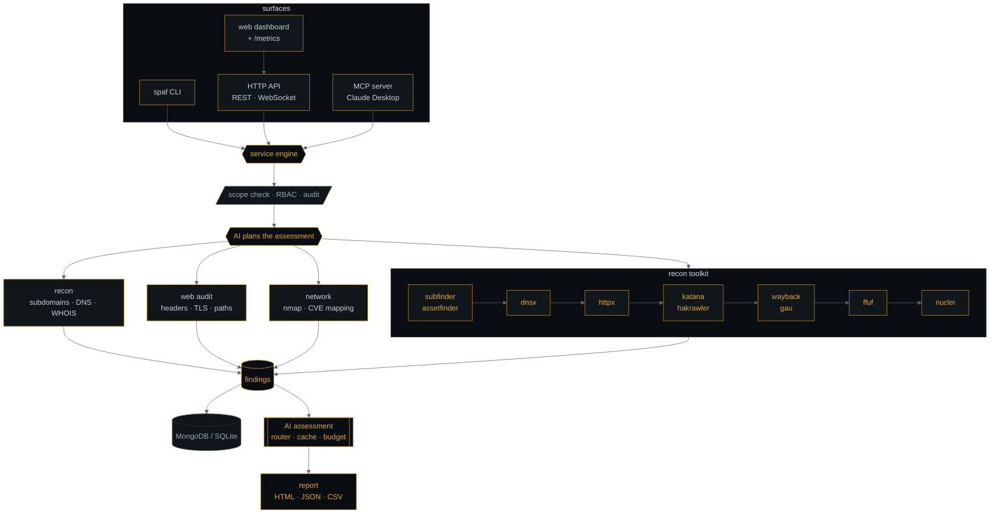

<!-- HERO: hand-crafted amber/steel terminal-card banner (assets/hero.svg,
     matches the CLI + dashboard design system) + a hosted typing ticker. -->
<div align="center">



<a href="https://github.com/geevarghesekthomas84-sys/spaf">
  
</a>

<p><b>AI-orchestrated offensive security</b> — one target in, a written assessment out.<br>
<sub>Built for Kali, bug bounty, and red-team work · <b>authorized testing only</b></sub></p>

<p>
  <a href="CHANGELOG.md"></a>
  <a href="https://github.com/geevarghesekthomas84-sys/spaf/actions/workflows/ci.yml"></a>
  <a href="https://python.org"></a>
  <a href="LICENSE"></a>
  <a href="https://github.com/geevarghesekthomas84-sys/spaf/stargazers"></a>
</p>

<p>
  
  
  
  
  
  
  
</p>

<sub>AI engines&nbsp; · &nbsp;Google Gemini&nbsp; · &nbsp;Anthropic Claude&nbsp; · &nbsp;Ollama&nbsp; · &nbsp;LM Studio&nbsp; · &nbsp;Shodan</sub>

</div>

---

> **Point SPAF at a target and it runs the engagement.** The AI plans the recon,
> SPAF runs the tools on your machine, and you get the findings plus a written
> assessment — built for Kali, bug bounty, and red-team work.

```bash
pip install "spaf[ai]"        # SPAF + the AI providers
spaf setup                    # pick your AI + database (SQLite = zero setup)
spaf agent target.com         # the AI plans → runs → reports, end to end
```

<sub>⚠️ Authorized testing only — see the <a href="#-legal-disclaimer">Legal Disclaimer</a>.</sub>

### What you get

- **`spaf agent`** — an autonomous agent: the AI chooses which modules to run, chains them, and writes the assessment.
- **Recon toolkit** — one pipeline wrapping `subfinder`, `httpx`, `nuclei`, `katana`, `dnsx`, `ffuf` and more.
- **AI threat analysis** after every scan — Gemini, Claude, Ollama, or LM Studio — plus PoC and remediation code on demand.
- **Full attack surface** — recon, network + CVE mapping, web audit, crawler, passive Shodan intel.
- **Scope-safe & stealthy** — engagement-scope enforcement, TOR, proxy rotation, UA randomization.
- **Zero-setup storage** — MongoDB, or a local SQLite file with nothing to install.
- **Share it** — dark-mode HTML/JSON reports, CSV export, and scan diffing.
- **Run it as a platform** — a headless HTTP API (REST + WebSocket), an **MCP server/client**, a built-in **web dashboard** + Prometheus metrics, a plugin SDK, a hardened Docker/Caddy deploy, and **multi-engagement workspaces with RBAC**.

---

## ◇ How it works

One target in, a written assessment out. Reach SPAF from any **surface** — the
CLI, the HTTP API, the web dashboard, or an MCP host — and they all drive the
**same engine**: every active step is scope-gated and audit-logged, runs the
modules on your machine, and the AI writes it up.



<sub>Run the whole chain with <code>spaf agent target.com</code>, any single stage on its own (<code>spaf recon</code>, <code>spaf toolkit</code>, <code>spaf scan</code>, …), or the same over the API / dashboard / MCP — all scope-gated and audit-logged through one engine.</sub>

---

## ◇ Core feature set

<table width="100%">
<tr>
<td valign="top" width="50%">

### 🧠 AI Intelligence Suite
Connect to any leading AI model for Red Team-grade analysis. After **every scan**, SPAF automatically sends findings to your configured AI and generates a module-specific intelligence report covering attack paths, exploitation techniques, CVE correlation, and actionable remediation — printed directly in the terminal.

**Supported providers (all work with every command):**
| Provider | Type | Shortcut |
|---|---|---|
| Google Gemini 2.0 Flash | ☁️ Remote | `spaf gemini` |
| Anthropic Claude 3.5 | ☁️ Remote | `spaf claude` |
| Ollama (local) | 💻 Streaming | `spaf ollama` |
| LM Studio (local) | 💻 Streaming | `spaf lmstudio` |

> Local providers (**Ollama / LM Studio**) stream tokens in real-time as they are generated.  
> Add `--no-ai` to any scan command to skip AI analysis.

</td>
<td valign="top" width="50%">

### 🕵️ Stealth & OpsSec Engine
Every single request is wrapped in configurable operational security layers.

- Native **TOR** integration (`socks5://`)
- Rotating **SOCKS5/HTTP proxy** chains
- Dynamic **User-Agent** fingerprint rotation
- Per-module **concurrency** & request delay controls

### 📡 Passive Shodan Intel
Set `SHODAN_API_KEY` in `.env` to enrich every recon scan with passive Shodan data — open ports, org, ISP, and country — **without sending a single packet to the target**.

</td>
</tr>
<tr>
<td valign="top" width="50%">

### 🔍 Reconnaissance Module
Build a complete attack surface map before firing a single payload.

- Passive subdomain enumeration via `crt.sh`
- Active DNS brute-forcing (12+ common prefixes)
- DNS Record audit: SPF, DMARC, AXFR zone transfer
- WHOIS registrant email exposure analysis
- **Shodan passive IP intelligence** (optional)
- **External recon toolkit** (`spaf toolkit`) — chains `subfinder`, `assetfinder`, `dnsx`, `httpx`, `katana`, `hakrawler`, `waybackurls`, `gau`, `ffuf` & `nuclei` into one pipeline (run `spaf tools` to check installs)

</td>
<td valign="top" width="50%">

### 🌐 Web Security Auditor
Deep-dive assessment of web application security posture.

- Security headers: CSP, HSTS, XFO, X-Content-Type
- Cookie flags: `Secure`, `HttpOnly`, `SameSite`
- Sensitive path probing: `.env`, `.git`, admin portals
- TLS/SSL: protocol versions, certificate expiry

</td>
</tr>
<tr>
<td valign="top" width="50%">

### 🔌 Network Intelligence
High-speed, configurable port scanning with automated threat correlation.

- **Nmap** integration with `light`, `normal`, `aggressive` profiles
- **RustScan** turbo-discovery (async TCP) → hand-off to Nmap for deep analysis
- Service version detection & OS fingerprinting
- Automated CVE mapping via **NIST NVD API** (rate-limited, supports API key)

</td>
<td valign="top" width="50%">

### 📊 Reporting & Export
Generate executive-grade deliverables.

- 🌑 **Dark-mode HTML Dashboard** with severity-ranked findings
- 📄 **Structured JSON** output for pipelines
- 📋 **CSV Export** (`spaf export`) for client-ready spreadsheets
- 🔍 **Scan Diff** (`spaf diff`) — compare any two scans visually

</td>
</tr>
<tr>
<td valign="top" width="100%" colspan="2">

### 🧰 External Recon Toolkit
Chain a suite of best-in-class open-source recon binaries into a single pipeline with `spaf toolkit`. Each stage feeds the next, and every tool is **optional** — missing binaries are skipped gracefully (check status with `spaf tools`).

```
subfinder / assetfinder  →  dnsx  →  httpx  →  katana / hakrawler
                                             →  waybackurls / gau  →  ffuf  →  nuclei
```

| Tool | Role | Tool | Role |
|---|---|---|---|
| `subfinder` | Passive subdomain enum | `waybackurls` | Wayback URL harvesting |
| `assetfinder` | Passive asset discovery | `gau` | getallurls historical fetch |
| `dnsx` | Fast DNS resolution | `ffuf` | Content / directory fuzzing |
| `httpx` | HTTP probing & fingerprinting | `nuclei` | Template-based vuln scanning |
| `katana` | Next-gen crawling | `hakrawler` | Fast endpoint crawler |

</td>
</tr>
</table>

---

## ◇ Demo

A 60-second tour — safe to run offline against `example.com`:

```bash
spaf tools                       # see which recon binaries are installed
spaf tools --install             # install the Go recon suite (requires Go)
spaf scope add example.com       # define engagement scope
spaf toolkit example.com         # subfinder → httpx → katana → nuclei pipeline
spaf report example.com --format html --with-ai   # shareable HTML report + AI analysis
```

> ▶️ Generate a walkthrough GIF for your fork with [`scripts/demo.sh`](scripts/demo.sh) — recipe in [`docs/demo.md`](docs/demo.md).

---

## ◇ Installation

### From PyPI (recommended)

```bash
pip install spaf                 # core
pip install "spaf[ai]"           # + Google / Claude / OpenAI-compatible providers
pip install "spaf[intel]"        # + Shodan passive intelligence
pip install "spaf[ai,intel]"     # everything
```

### From source (for development)

```bash
git clone https://github.com/geevarghesekthomas84-sys/spaf.git
cd spaf
python -m venv venv
source venv/bin/activate         # Windows: venv\Scripts\activate
pip install -e ".[ai,intel,dev]" # editable install with all extras + test tools
```

### First run

```bash
cp .env.example .env             # configure providers / MongoDB / stealth
spaf --install-completion        # shell tab-completion (optional)
spaf tools --install             # install the recon toolkit binaries (needs Go)
spaf setup                       # interactive configuration wizard
```

> **Requirements:** Python 3.11+, [Nmap](https://nmap.org), MongoDB (local or remote)
>
> **Optional:** [RustScan](https://github.com/RustScan/RustScan) for ultra-fast port discovery
> · the [recon toolkit](#-external-recon-toolkit) binaries (`spaf tools` to check)
> · Shodan via the `intel` extra above

---

## ◇ Docker / Podman

The fastest way to get running — no manual setup of MongoDB or Python environment needed.

```bash
# 1. Start MongoDB + SPAF in one command
docker-compose up -d

# 2. Run any scan
docker-compose run spaf recon target.com
docker-compose run spaf scan target.com --scanner rustscan --ports 1-65535

# 3. Drop into interactive AI shell
docker-compose run spaf shell

# Override the entire command
docker-compose run spaf export target.com --format csv
```

> **Note:** `docker-compose.yml` uses `network_mode: host` so Nmap/RustScan can reach real targets.  
> `.env` is automatically mounted from the project root — add your API keys there.

**Podman** works with the same files — swap the command:

```bash
podman compose up -d                 # Podman 4.4+ (uses the compose provider)
# or: podman-compose up -d
podman compose run spaf recon target.com
```

> On **SELinux** hosts (Fedora/RHEL), if a bind mount gives "permission denied",
> add a `:z` (shared) / `:Z` (private) suffix to the volume — e.g.
> `./scope.json:/app/scope.json:z` — or run with `--security-opt label=disable`.
> Rootless Podman already has host networking; `network_mode: host` is honored.

---

## ◇ Configuration

Copy `.env.example` to `.env` and configure your providers:

```bash
# ─── AI Provider (choose one) ────────────────────────────────────
AI_PROVIDER=google            # google | claude | ollama | lmstudio

# Remote providers
GOOGLE_API_KEY=your_key
ANTHROPIC_API_KEY=your_key

# Model overrides (optional — defaults shown)
GOOGLE_MODEL=gemini-2.0-flash
ANTHROPIC_MODEL=claude-3-5-sonnet-20241022

# Local providers
OLLAMA_URL=http://localhost:11434/v1
OLLAMA_MODEL=llama3.2             # optional, auto-detected
LM_STUDIO_URL=http://localhost:1234/v1
LM_STUDIO_MODEL=your-model        # optional, auto-detected from loaded model

# ─── APIs ────────────────────────────────────────────────────────
NIST_API_KEY=your_key             # free: https://nvd.nist.gov/developers/request-an-api-key
SHODAN_API_KEY=your_key           # free: https://account.shodan.io/register

# ─── Stealth / OpsSec ────────────────────────────────────────────
USE_TOR=false
PROXY_FILE=./proxies.txt
RANDOM_USER_AGENT=true

# ─── Database ────────────────────────────────────────────────────
SPAF_DB_BACKEND=mongo                      # mongo (default) | sqlite
SPAF_MONGO_URI=mongodb://localhost:27017   # used when backend = mongo
SPAF_SQLITE_PATH=spaf.db                   # used when backend = sqlite
```

> **No MongoDB? Use the SQLite fallback.** Set `SPAF_DB_BACKEND=sqlite` (or pick
> it in `spaf setup`) and SPAF stores everything in a local file — no database
> server needed. Great for quick/offline use.

---

## ◇ Usage

> 📖 **Full command reference with all flags and examples → [COMMANDS.md](COMMANDS.md)**

```bash
# ─── Autonomous Agent (AI plans & chains the modules) ────────────
spaf agent target.com                                # plan → confirm → run → AI assessment
spaf agent target.com --goal "find web vulns" -y     # steer it, skip the prompt
spaf agent target.com --dry-run                      # preview the plan only

# ─── Reconnaissance ──────────────────────────────────────────────
spaf recon target.com                                # Recon + AI + Shodan (if key set)
spaf recon target.com --passive --no-ai              # Passive OSINT only

# ─── Network Scanning ────────────────────────────────────────────
spaf scan target.com                                 # Nmap + AI analysis
spaf scan target.com --scanner rustscan --ports 1-65535  # RustScan → Nmap
spaf scan target.com --intensity aggressive          # Deep scan (-sV -sC -O -A)

# ─── Web Security ────────────────────────────────────────────────
spaf webscan https://target.com                      # Full web audit + AI
spaf crawl https://target.com --depth 3              # Spider + AI

# ─── External Recon Toolkit ──────────────────────────────────────
spaf tools                                           # Show which recon tools are installed
spaf toolkit target.com                              # Full pipeline: subfinder→httpx→katana→nuclei
spaf toolkit target.com --no-nuclei --no-crawl       # Passive recon only (no active scan)
spaf toolkit target.com --fuzz --wordlist wl.txt     # Add ffuf content fuzzing
spaf toolkit target.com --nuclei-severity critical,high --output recon.json

# ─── AI Provider Shortcuts (all context-safe) ────────────────────
spaf test-ai                                         # Health check + status table
spaf chat "How do I bypass a WAF?"                   # Configured provider
spaf gemini "Explain CVE-2024-1234"                  # Google Gemini
spaf claude "Write an Ansible remediation task"      # Anthropic Claude
spaf ollama "List SMB exploitation paths"            # Ollama — live streaming
spaf lmstudio "Analyze these HTTP headers"           # LM Studio — live streaming

# ─── AI Analysis on past scans ───────────────────────────────────
spaf ai <scan_id>                                    # Re-analyze (no re-scan)
spaf ai <scan_id> --provider ollama                  # Use Ollama for this run

# ─── Exploit & Remediation ───────────────────────────────────────
spaf poc <finding_id>                                # Generate Python exploit script
spaf poc <finding_id> --output exploit.py
spaf remediate <finding_id> --format ansible         # Fix code (ansible/terraform/bash)

# ─── Operations ──────────────────────────────────────────────────
spaf export target.com --format csv                  # Export findings to CSV
spaf export target.com --format json                 # Export findings to JSON
spaf diff <scan_id_1> <scan_id_2>                    # Compare two scans
spaf scope show                                      # View engagement scope
spaf scope add target.com                            # Add to scope
spaf scope remove target.com                         # Remove from scope
spaf watch target.com --interval 3600 --module webscan   # 24/7 monitoring
spaf report target.com --format html                 # Premium HTML report
spaf history                                         # Past scan records
spaf shell                                           # Interactive AI shell
spaf update                                          # Update SPAF to latest
```

---

## ◇ MCP server <sup>new in 1.5</sup>

Run SPAF as an **MCP server** so Claude Desktop (or any MCP host) can drive it
with natural language — recon, the toolkit, scans, and the autonomous agent, all
as native tools, locally.

```bash
pip install "spaf[mcp]"           # installs the MCP support
spaf scope add target.com         # authorize a target first
spaf mcp                          # serve over stdio
```

Add it to **Claude Desktop** (`claude_desktop_config.json`):

```json
{
  "mcpServers": {
    "spaf": { "command": "spaf", "args": ["mcp"] }
  }
}
```

Then ask Claude things like *"recon target.com and summarize the risks."*

**Safety model** (a model is calling these):
- Scope is enforced **inside every tool** — out-of-scope targets are refused, and
  there is **no bypass flag** exposed to the model.
- `agent_run` is **plan-only by default**; active execution needs an explicit
  `dry_run=false` and an in-scope target.
- **No raw-command tool** — the model only selects SPAF's fixed modules.
- Every active call is written to an **audit log** (`logs/audit.jsonl`).

> See [`docs/ROADMAP_V2.md`](docs/ROADMAP_V2.md) for the full platform plan
> (HTTP API, model router, secure gateway, dashboard).

---

## ◇ HTTP API <sup>new in 1.6</sup>

Run SPAF as a service — everything the CLI does, over REST, with **live scan
events over WebSocket**. Secure by default: every endpoint except `/health` and
`/version` needs an API key, and active scans are scope-gated.

```bash
pip install "spaf[api]"
export SPAF_API_KEYS="your-secret-key"   # or let it print a generated one
spaf serve                               # http://127.0.0.1:8000  (docs at /docs)
```

```bash
# start a scan (returns a job id), then stream it
curl -s -XPOST localhost:8000/scans -H "X-API-Key: $KEY" \
     -H 'content-type: application/json' \
     -d '{"module":"toolkit","target":"example.com"}'
# → {"job_id":"…","status":"running"}
#   GET /jobs/{id}         → status + typed findings
#   WS  /ws/jobs/{id}      → live step/finding events
```

| Endpoint | What it does |
|---|---|
| `GET /health`, `GET /version` | open health/version |
| `GET /metrics` | open Prometheus metrics (aggregate only) |
| `GET /`, `GET /dashboard` | built-in web console (open) |
| `GET /whoami` | your principal (role + engagements) |
| `GET /engagements`, `POST /engagements` | list / create engagements (create = lead) |
| `GET /scope`, `POST /scope` | view / add engagement scope |
| `GET /tools` | external-tool install status |
| `GET /audit` | recent active-action audit entries |
| `POST /scans`, `POST /agent` | start a scan / agent job (202 + job id) |
| `GET /jobs/{id}` | job status + typed result |
| `WS /ws/jobs/{id}` | live progress & findings |
| `GET /scans/recent`, `GET /findings/{id}` | history / findings |

> Bind `--host 0.0.0.0` only behind the reverse-proxy gateway (TLS/auth) — see
> the roadmap. Interactive API docs are at `/docs`.

---

## ◇ Dashboard & metrics <sup>new in 1.10</sup>

The API ships a **self-contained web console** and **Prometheus metrics** — no
extra install beyond `spaf[api]`.

```bash
spaf serve
open http://127.0.0.1:8000/          # the dashboard (enter your API key to connect)
curl -s localhost:8000/metrics       # Prometheus scrape target
```

- **Dashboard (`/`)** — a single vanilla-JS page in the CLI's amber/steel theme:
  connect with your `X-API-Key`, see scope/tools status, launch a scan or an
  agent run (with dry-run), watch **live events over WebSocket**, and read the
  findings and audit tables as they fill.
- **Metrics (`/metrics`)** — scans started/completed/failed by module, findings
  by severity, agent runs by mode, and auth failures, in Prometheus text format.
  Labels are **aggregate only** (no target names), so the endpoint is safe to
  scrape without leaking engagement data. Left open so scrapers need no key.
- **Audit (`/audit`)** — key-protected tail of the JSONL audit log: the
  who/what/target/when record written for every active action.

---

## ◇ Secure deploy <sup>new in 1.8</sup>

Run the API hardened, behind a TLS reverse-proxy gateway — one command.

```bash
cd deploy
cp .env.example .env            # set SPAF_API_KEYS (and SPAF_DOMAIN for real TLS)
docker compose up -d --build    # Caddy gateway + API (SQLite, zero-setup)
curl -k https://localhost/health
```

- **Caddy gateway** — automatic TLS, security headers, request-size cap; opt-in
  **mTLS** and rate-limiting. Only the gateway is exposed; the API is internal.
- **Hardened API container** — non-root, read-only root FS (state under `/data`),
  `cap_drop: ALL`, `no-new-privileges`, resource limits, healthcheck.
- **CI image scanning** (Trivy) + **sops/age** secrets.

> Full guide — mTLS, rate-limiting, secrets, and the authorized-egress note —
> in [`SECURITY_HARDENING.md`](SECURITY_HARDENING.md).

---

## ◇ Extend it <sup>new in 1.9</sup>

**Plugins** — add your own scan module by subclassing `PluginModule` and
advertising it via the `spaf.modules` entry-point group:

```toml
# your plugin's pyproject.toml
[project.entry-points."spaf.modules"]
myscan = "my_pkg.module:MyScanModule"
```

```bash
spaf plugins            # list discovered plugins
spaf myscan target.com  # runs like a built-in (CLI / API / MCP)
```

**Consume external MCP servers** — point SPAF at other MCP servers (CVE/OSINT
feeds, your own tools) in Claude-Desktop shape (`mcp_servers.json`):

```bash
spaf mcp-tools          # list tools exposed by the configured servers
```

> Plugins and external MCP tools run through the CLI/API/service — they are not
> auto-added to the autonomous agent's fixed action set (that stays curated).

**Machine-readable output** — every surface returns the same typed models; emit
their **JSON Schema** so downstream tooling can validate SPAF output:

```bash
spaf schema --write docs/schemas     # or: GET /schema over the API
```

> Architecture, request flow, and all three extension seams (modules, providers,
> output consumers) are documented in [`docs/ARCHITECTURE.md`](docs/ARCHITECTURE.md);
> the checked-in schemas live in [`docs/schemas/`](docs/schemas/).

---

## ◇ Engagements & RBAC <sup>new in 1.11</sup>

Run multiple **isolated engagements** with **role-based access control** — for
teams and concurrent client work. Each engagement has its own scope, audit
trail, and report storage; nothing leaks between them.

```bash
# create an engagement (optionally with a signed client authorization)
export SPAF_AUTH_SIGNING_KEY="…"      # minting key for authorizations
spaf engagements --create "Acme Corp" --scope "acme.com,api.acme.com" \
                 --authorized-by "ciso@acme.com" --retention-days 90
spaf engagements                       # list them
```

**Roles** — map API keys to a role and the engagements they may touch:

```bash
export SPAF_PRINCIPALS='{
  "LEAD_KEY":  {"name":"lead","role":"lead","engagements":["*"]},
  "OP_KEY":    {"name":"op","role":"operator","engagements":["acme-corp"]},
  "VIEW_KEY":  {"name":"client","role":"viewer","engagements":["acme-corp"]}
}'
spaf serve
```

| Role | Can |
|---|---|
| **viewer** | read scope, tools, findings, audit |
| **operator** | + launch scans & active agent runs (in allowed engagements) |
| **lead** | + manage scope, create engagements, sign authorizations |

Over the API, send `X-API-Key` (→ your role) and `X-Engagement: <id>` to pick the
workspace. `GET /whoami` shows your identity; `GET/POST /engagements` list/create
them. A **viewer** gets `403` on active endpoints; access outside your granted
engagements is `403`; an unknown engagement is `404`.

- **Signed authorizations** — with `SPAF_AUTH_SIGNING_KEY` set, an engagement's
  authorization is a tamper-evident HMAC over its id, scope hash, authorizer, and
  expiry. Editing the stored scope or expiry invalidates it, and active runs are
  refused without a valid, unexpired signature.
- **Backwards-compatible** — with no `SPAF_PRINCIPALS` set, your existing
  `SPAF_API_KEYS` act as all-access **leads** and a single default engagement is
  used, so nothing changes until you opt in.

---

## ◇ AI providers

> **Model routing, caching & budgets** (1.7+): the agent routes each task to a
> model you choose (`SPAF_MODEL_PLAN`, `SPAF_MODEL_ANALYZE`, …, comma-separated
> for fallbacks), caches responses (`SPAF_CACHE=off` to disable), and bounds each
> run (`SPAF_BUDGET_CALLS` / `SPAF_BUDGET_SECONDS`). Unset = your provider's default.

### Quick Comparison

| Provider | Type | Model | Privacy | Streaming | Best For |
| :--- | :---: | :--- | :---: | :---: | :--- |
| **Google Gemini** | ☁️ Remote | `gemini-2.0-flash` | Low | ❌ | Fastest, largest context |
| **Anthropic Claude** | ☁️ Remote | `claude-3-5-sonnet-20241022` | Low | ❌ | Report writing, remediation |
| **Ollama** | 💻 Local | auto-detected | ✅ High | ✅ Live | Air-gapped, unlimited usage |
| **LM Studio** | 💻 Local | auto-detected | ✅ High | ✅ Live | Private, no data leaves host |

### Ollama Setup

```bash
# 1. Install Ollama → https://ollama.com
# 2. Pull a model
ollama pull llama3.2
ollama pull qwen2.5-coder   # great for exploit/remediation code

# 3. Set in .env
AI_PROVIDER=ollama
OLLAMA_URL=http://localhost:11434/v1   # default, change if remote
OLLAMA_MODEL=llama3.2                  # optional — auto-detected if not set

# 4. Test connection
spaf test-ai

# 5. Use shortcut (tokens stream in real-time)
spaf ollama "List exploitation paths for open SMB ports"
```

### LM Studio Setup

```bash
# 1. Download LM Studio → https://lmstudio.ai
# 2. Load any GGUF model in the app
# 3. Go to: Local Server tab → Start Server

# 4. Set in .env
AI_PROVIDER=lmstudio
LM_STUDIO_URL=http://localhost:1234/v1  # default
LM_STUDIO_MODEL=your-model-name         # optional — auto-detected from loaded model

# 5. Test connection
spaf test-ai

# 6. Use shortcut (tokens stream in real-time)
spaf lmstudio "Analyze these HTTP headers for security risks"
```

> **All AI name variants accepted:** `lmstudio`, `lm-studio`, `lm_studio` all work as `AI_PROVIDER` values.

---

## ◇ Shodan intel

Enrich every `spaf recon` scan with **passive Shodan intelligence** — open ports, org, ISP, and country — without sending any packets to the target.

```bash
# 1. Get a free API key → https://account.shodan.io/register
# 2. Add to .env
SHODAN_API_KEY=your_api_key

# 3. Install the Shodan library
pip install shodan

# 4. Run recon — Shodan data is fetched automatically
spaf recon target.com
```

---

## ◇ Diff & export

```bash
# View scan history to get IDs
spaf history

# Compare two scans — see what's new, fixed, or unchanged
spaf diff <older_scan_id> <newer_scan_id>

# Export all findings for a target to CSV (for clients)
spaf export target.com --format csv
spaf export target.com --format json --output /tmp/findings.json
```

---

## ◇ Safety & hardening

SPAF is **authorized-testing-only** tooling, built fail-safe. Layered controls:

- **Scope enforcement** — out-of-scope targets are refused (fail-closed when a
  scope is set); **signed authorizations** gate active runs.
- **Overly-broad-scan rejection** — wildcards, `0.0.0.0/0`, and huge CIDRs are
  refused at the input boundary, so you can't accidentally scan the internet.
- **RBAC + rate limiting** — roles (viewer/operator/lead) and per-key limits
  (`429`) over the API.
- **No shell execution of untrusted text** — external tools run as argument
  lists (never `shell=True`), guarded by a destructive-command denylist;
  AI/target output is sanitized before it's logged, stored, or shown.
- **Secret redaction** — API keys and tokens are scrubbed from every log sink.
- **Supply chain** — Trivy + `pip-audit` + a CycloneDX SBOM in CI.

```bash
# Dry-run the pipeline without touching any target (synthetic findings):
SPAF_MOCK=1 spaf webscan target.com        # any module / the agent honor it
SPAF_MOCK=1 spaf agent target.com -y       # or over the API: options {"mock": true}
```

> Full detail — assets, trust boundaries, and a per-workflow **risk
> classification** — in [`docs/THREAT_MODEL.md`](docs/THREAT_MODEL.md). Deploy
> hardening in [`SECURITY_HARDENING.md`](SECURITY_HARDENING.md).

---

## ◇ Engagement scope

```bash
# Initialise scope (creates scope.json in current directory)
spaf scope add target.com
spaf scope add 10.0.0.0/24

# View current scope
spaf scope show

# Remove a target
spaf scope remove 10.0.0.0/24

# Use a custom scope file
spaf scope show --file engagement_scope.json
```

---

## ◇ Project structure

```
spaf/
├── spaf/
│   ├── cli/          # Typer CLI — all commands
│   ├── core/         # Async engine & BaseModule
│   ├── agent/        # autonomous AI orchestrator (spaf agent)
│   ├── orchestration/# model router, response cache, run budgets
│   ├── modules/      # recon, network, webscan, crawler, toolkit
│   ├── service/      # UI-free facade (scope, audit, events) shared by API/MCP
│   ├── api/          # FastAPI REST + WebSocket, metrics, dashboard
│   ├── mcp/          # MCP server (expose tools) + client (consume servers)
│   ├── plugins/      # third-party scan-module SDK + registry
│   ├── workspaces/   # multi-engagement workspaces + RBAC + signed auth
│   ├── utils/        # AI orchestrator, proxy, risk, validator, scope, logger
│   ├── database/     # MongoDB (Motor) / SQLite async backends
│   └── reports/      # HTML & JSON report generator
├── deploy/           # hardened Docker image + Caddy TLS gateway + compose
├── tests/            # Pytest test suite
├── docs/             # roadmap, demo recipe, extra docs
├── .github/          # CI + release + security workflows, issue/PR templates
├── Dockerfile        # Python 3.12-slim + nmap + Go recon suite
├── docker-compose.yml # MongoDB 7 + SPAF with healthcheck
├── scope.json        # Engagement scope (auto-created)
├── COMMANDS.md       # Full command reference
└── .env.example      # Configuration template
```

---

## ◇ Contributing & releasing

Contributions are welcome — see [CONTRIBUTING.md](CONTRIBUTING.md) and the
[Code of Conduct](CODE_OF_CONDUCT.md). In short:

```bash
pip install -e ".[dev]"
pytest -q                 # tests
ruff check spaf tests     # lint
python -m build           # wheel
```

CI runs these on every push and pull request. Notable changes go in
[CHANGELOG.md](CHANGELOG.md).

**Releasing to PyPI** is automated via [Trusted Publishing](https://docs.pypi.org/trusted-publishers/):
tag a version and push, and the `Release` workflow builds and publishes it.

```bash
git tag v1.0.1
git push origin v1.0.1        # → builds, checks, and publishes to PyPI
```

> One-time setup: on PyPI, add a trusted publisher for this repo pointing at
> the `release.yml` workflow and the `pypi` environment.

---

## ◇ Stealth & OpsSec

| Variable | Description |
|---|---|
| `USE_TOR=true` | Route all requests through TOR (`socks5://127.0.0.1:9050`) |
| `PROXY_FILE=./proxies.txt` | Rotating SOCKS5/HTTP proxy chain file |
| `RANDOM_USER_AGENT=true` | Randomise browser User-Agent per request |
| `NIST_API_KEY=<key>` | NIST NVD API key (10× CVE lookup rate — free signup) |
| `SHODAN_API_KEY=<key>` | Passive Shodan intel in recon (free tier available) |

---

## ◇ Legal disclaimer

> This tool is intended **strictly** for authorized security testing, research, and educational purposes only. The developer assumes **no liability** for any misuse or damage caused. Always obtain **explicit written permission** from the target organization before conducting any security tests.

---

<div align="center">

Built with 🔥 by **[geevarghesekthomas84-sys](https://github.com/geevarghesekthomas84-sys)**

⭐ If you find SPAF useful, please consider starring the repository — it helps a lot!

</div>
