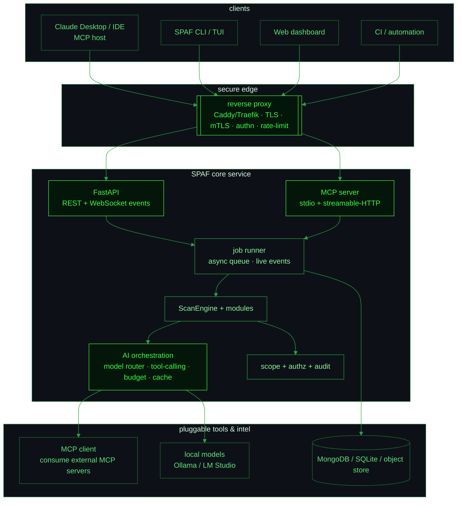

# SPAF v2 — AI-Orchestrated Offensive Security Platform

> **Thesis.** SPAF is already a solid AI-augmented CLI. v2 turns it into a *platform*:
> a local AI orchestration brain that drives a fleet of security modules, speaks
> **MCP** so any agent (Claude Desktop, IDEs, other LLMs) can operate it, and runs
> behind **hardened, automated infrastructure** (reverse-proxy gateway, mTLS,
> secrets, containers) suitable for real engagements.
>
> **Non-negotiable:** everything stays **authorized-use only** and **scope-gated**.
> Every new surface (API, MCP, redirector) ships with authn/authz, audit logging,
> and the existing engagement-scope enforcement wired in from day one.

This is a plan, not a commitment to build it all at once. Each phase is
independently shippable and leaves `main` green.

**Status:** ✅ Phase 0 (service layer) · ✅ Phase 1 (HTTP API) ·
✅ Phase 2 minimal (MCP server, stdio) · ✅ Phase 3 (AI orchestration: router,
cache, budget, fallback) — shipped. Next: Phase 5 (secure gateway) or Phase 4
(MCP client + plugin SDK).

---

## 1. Where we are (v1.4.0)

```
CLI (typer) ──> ScanEngine ──> modules (recon, toolkit, network, webscan, crawler)
                     │              └─ external tools: subfinder/httpx/nuclei/nmap/...
                     ├─ AIOrchestrator (google | claude | ollama | lmstudio)
                     ├─ PentestAgent (AI plans → runs modules → assesses)
                     ├─ scope enforcement (utils/scope)
                     └─ storage (MongoDB | SQLite)
```

Strengths to keep: async engine, pluggable modules, provider-agnostic AI, the
agent, scope safety, SQLite fallback, the design system.

Gaps that block "platform": no programmatic API, no MCP, single-shot AI calls
(no router/tool-calling/budget), no service hardening, no live/streamed runs,
no shared state across agents.

---

## 2. Target architecture (v2)



Four new pillars, all in-process-capable so the CLI/offline story never breaks:

1. **SPAF API** — async REST + WebSocket. Everything the CLI does, over HTTP, with
   live scan events and job control.
2. **SPAF MCP server** — exposes modules + the agent as MCP *tools*, scans as
   *resources*, analysis templates as *prompts*. This is the flagship: it makes
   SPAF a first-class citizen of local AI orchestration (Claude Desktop, etc.).
3. **AI orchestration layer** — a real router (task→model), structured
   tool-calling where providers support it, token budgets, response caching, and
   a fallback chain. The agent graduates from "plan once" to a controlled loop.
4. **Secure infrastructure** — a reverse-proxy gateway (TLS/mTLS/auth/rate-limit),
   secrets management, hardened Docker Compose stack, and an *authorized* egress
   redirector profile.

---

## 3. Phased roadmap

Each phase: **goal · build · stack · deliverable · acceptance**. Phases are
ordered by leverage; 2 (MCP) and 3 (orchestration) are the headline.

### Phase 0 — Foundation refactor  *(small, enabling)*
- **Goal:** make the engine callable as a library without the CLI, with typed
  results and an event stream.
- **Build:** extract a `spaf.service` core API (`run_module`, `run_agent`,
  `list_scans`, `get_findings`) returning Pydantic models; add an async
  `EventBus` so runs emit `step_started/finding/step_done/completed` events;
  decouple rendering from execution.
- **Stack:** Pydantic v2, `asyncio` event bus.
- **Deliverable:** `spaf/service/` + models; CLI refactored to consume it.
- **Acceptance:** CLI behaves identically; a unit test drives a scan via the
  service and receives events. No new deps required.

### Phase 1 — SPAF API (FastAPI)
- **Goal:** operate SPAF over HTTP with live updates.
- **Build:** FastAPI app; `POST /scans` (module+target+options → job id),
  `GET /scans/{id}`, `GET /findings`, `POST /agent`, `GET /scope`, `WS /events`
  streaming the EventBus. Job runner backed by asyncio (optionally Redis/arq
  later). API-key auth + per-key scope.
- **Stack:** FastAPI, uvicorn, websockets; optional `arq`+Redis for durable jobs.
- **Deliverable:** `spaf/api/`, `spaf serve` command, OpenAPI docs.
- **Acceptance:** start server, launch an agent run over REST, watch findings
  stream over WebSocket; scope rejection returns 403.

### Phase 2 — SPAF MCP server  ⭐ flagship
- **Goal:** any MCP host (Claude Desktop, IDEs, other agents) can drive SPAF as
  native tools, locally.
- **Build:** MCP server exposing
  - **tools:** `recon`, `toolkit`, `scan`, `webscan`, `crawl`, `agent_run`,
    `report_generate`, `scope_add`, `scope_show`, `tools_status`;
  - **resources:** `scan://{id}` findings, `report://{id}` artifacts;
  - **prompts:** the module analysis templates.
  Two transports: **stdio** (for Claude Desktop) and **streamable-HTTP/SSE**
  (networked, behind the gateway). Scope + audit enforced inside every tool;
  long scans return a job id + progress notifications.
- **Stack:** official **MCP Python SDK** (`mcp`), reuse `spaf.service`.
- **Deliverable:** `spaf/mcp/server.py`, `spaf mcp` command, a ready-to-paste
  Claude Desktop config block, docs + tests (tool schemas, scope gating).
- **Acceptance:** add SPAF to Claude Desktop; ask it to "recon example.com and
  summarize" and it calls the tools, respecting scope.
- **Reference:** build with the `mcp-builder` skill.

### Phase 3 — Local AI orchestration
- **Goal:** smarter, cheaper, more reliable AI — the "orchestration" in the brief.
- **Build:**
  - **Model router:** map task-type → model (planning→strong; bulk analysis→local;
    code-gen→coding model). Config-driven, provider-agnostic.
  - **Structured tool-calling loop:** for providers that support tools
    (Claude, OpenAI-compatible/LM Studio), let the model *call SPAF tools
    directly* in a bounded ReAct loop with a step cap — the agent becomes truly
    autonomous but still scope-gated and confirmable.
  - **Budgets + caching:** per-run token/time budget; prompt→response cache keyed
    by hash to cut cost and latency; deterministic replay.
  - **Fallback chain:** provider/model failover.
- **Stack:** extend `spaf.utils.ai`; JSON-schema structured output; local cache
  (SQLite/Redis).
- **Deliverable:** `spaf/orchestration/` (router, budget, cache, tool-loop).
- **Acceptance:** one agent run uses two different models for plan vs. analysis;
  cache hit on re-run; a forced provider outage falls back cleanly.

### Phase 4 — MCP client + plugin ecosystem
- **Goal:** SPAF *consumes* external capabilities, and third parties extend it.
- **Build:** an MCP **client** so the orchestrator can mount external MCP servers
  (CVE/intel feeds, OSINT, a user's own tools) as additional agent tools; a
  typed **plugin SDK** (register modules/tools/report formats) that supersedes
  today's `plugins/` dir.
- **Stack:** MCP SDK (client side), entry-point-based plugin discovery.
- **Deliverable:** `spaf/mcp/client.py`, `spaf/plugins/` SDK + example plugin.
- **Acceptance:** mount an external MCP server; the agent uses one of its tools
  during a run.

### Phase 5 — Secure infrastructure (automated)
- **Goal:** production-grade, hardened deployment — the "secure infrastructure,
  reverse proxies" in the brief.
- **Build:**
  - **Reverse-proxy gateway** (Caddy or Traefik) in front of API+MCP:
    automatic TLS, optional **mTLS** client certs, API-key/JWT auth, rate
    limiting, security headers. One compose command brings up gateway + SPAF +
    DB + local model.
  - **Secrets:** `.env` → `sops`/`age`-encrypted secrets; no plaintext keys in
    images; per-engagement secret scoping.
  - **Hardening:** non-root containers, read-only FS where possible, dropped
    capabilities, resource limits, image scanning in CI (Trivy), SBOM.
  - **Authorized egress redirector (opt-in):** a profile that routes tool egress
    through a controlled proxy/Tor for sanctioned engagements — **off by
    default**, gated behind an explicit `--authorized` flag + a signed engagement
    file, with the scope list enforced. Documented as authorized-use-only.
- **Stack:** Caddy/Traefik, Docker Compose, sops/age, Trivy, GH Actions.
- **Deliverable:** `deploy/` (compose + gateway config), `SECURITY_HARDENING.md`.
- **Acceptance:** `docker compose up` yields a TLS-fronted, authenticated SPAF;
  an unauthenticated request is rejected at the edge; CI scans images.

### Phase 6 — Observability + web dashboard
- **Goal:** see runs, findings, and agent reasoning live; keep an audit trail.
- **Build:** structured JSON logs, an **audit log** (who/what/target/when for
  every active action), Prometheus metrics + OpenTelemetry traces, and a small
  **web dashboard** (live findings, agent timeline, reports) talking to the API
  over WebSocket.
- **Stack:** `structlog`, OpenTelemetry, Prometheus, a light frontend (HTMX or a
  small React/Vite app) served behind the gateway.
- **Deliverable:** `spaf/telemetry/`, `dashboard/`.
- **Acceptance:** run an agent; watch it live in the dashboard; audit log records
  every active step; `/metrics` scrapes.

### Phase 7 — Multi-engagement & RBAC  *(stretch)*
- **Goal:** teams and multiple concurrent engagements.
- **Build:** engagement workspaces (isolated scope + storage + secrets), roles
  (operator/lead/viewer), signed engagement authorizations, result retention
  policies.
- **Deliverable:** `spaf/workspaces/`, RBAC middleware.
- **Acceptance:** two engagements run isolated; a viewer can't launch active
  scans.

---

## 4. Tech decisions (proposed)

| Concern | Choice | Why |
|---|---|---|
| Web API | **FastAPI + uvicorn** | async-native, Pydantic, OpenAPI for free |
| MCP | **official `mcp` Python SDK** | the standard; stdio + HTTP transports |
| Jobs | asyncio now → **arq + Redis** when durability needed | start light, scale later |
| Schemas | **Pydantic v2** | one model layer for CLI/API/MCP |
| Gateway | **Caddy** (auto-TLS) or Traefik | least-effort hardened edge |
| Secrets | **sops + age** | encrypted-at-rest, git-friendly |
| Telemetry | **structlog + OpenTelemetry + Prometheus** | audit + metrics + traces |
| Dashboard | **HTMX** (or Vite/React) | keep it light, API-driven |
| Packaging | extras: `spaf[api]`, `spaf[mcp]`, `spaf[all]` | core stays dependency-light |

Everything new is **optional at install** — the offline CLI + SQLite story never
regresses.

---

## 5. Security & ethics guardrails (apply to every phase)

- **Scope first:** every active action (API, MCP, agent, redirector) passes
  through the existing scope check; out-of-scope is refused, not warned.
- **Authn/authz** on every network surface; nothing listens unauthenticated.
- **Audit everything active:** immutable audit log of operator, target, action,
  time — for client deliverables and accountability.
- **No illegal capabilities:** the redirector and any egress routing are
  authorized-engagement-only, opt-in, documented, and gated behind an explicit
  flag + engagement authorization. SPAF does not add evasion/persistence meant
  for unauthorized use.
- **Safe defaults:** TLS on, auth on, redirector off, destructive options behind
  confirmation.

---

## 6. Suggested sequencing

```
Phase 0  ──▶  Phase 1 (API)  ──▶  Phase 2 (MCP ⭐)  ──▶  Phase 3 (orchestration)
                                      │
                                      └──▶ Phase 5 (secure infra) can start in parallel
Phase 4, 6, 7 follow.
```

**Fastest path to "wow":** Phase 0 → **Phase 2 (MCP)**. Standing SPAF up as an
MCP server that Claude Desktop can drive — scope-gated — is the single most
differentiating move and proves the whole platform thesis in one shippable step.

---

## 7. First concrete step (on approval)

Ship **Phase 0 + a minimal Phase 2**:
1. Extract `spaf/service/` (typed, CLI-independent) + an `EventBus`.
2. Add `spaf/mcp/server.py` exposing `recon`, `toolkit`, `scan`, `agent_run`,
   `scope_*` as MCP tools over stdio, scope-enforced, with tests.
3. Add `spaf mcp` command + a Claude Desktop config snippet in the docs.
4. New extra `spaf[mcp]`; CI covers it; version → `2.0.0-alpha`.

Then iterate outward (HTTP transport, orchestration, gateway).
